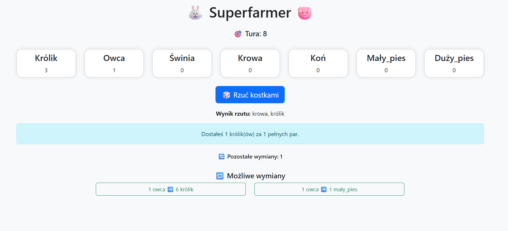

# 🐰 Superfarmer

The **SuperFarmer** is a browser-based version of the board game. Developed in Python using the Flask framework and styled with Bootstrap, this project allows a player to manage a virtual farm by breeding animals, trading on the market, and protecting the herd from threats.
## 🎯 Key Features

* **Turn-Based Gameplay:** The player rolls two dice each turn and makes strategic decisions.
* **Animal Breeding:** Animals reproduce automatically based on the number of full pairs (including those rolled).
* **Herd Management:** Trade animals based on dynamic market rates.
* **Threat Events:** Handle wild animal attacks (fox and wolf) according to the rules.

## 🧰 Technologies Used

* **Python 3.13.1+:** Core programming language.
* **Flask:** Python web framework.
* **Bootstrap:** CSS framework for responsive design.

## ⚙️ Installation & Setup

### Requirements:

* Python 3.12.9+
* Pip
* Virtualenv (optional)

### Installation:

1. Clone the repository:

   ```bash
   git clone https://github.com/klaudiaszostek/SuperFarmer
   ```

2. Create and activate a virtual environment:

   ```bash
   python -m venv venv
   .\venv\Scripts\activate   # Windows
   source venv/bin/activate  # macOS/Linux
   ```

3. Install the dependencies:

   ```bash
   pip install -r requirements.txt
   ```

4. Run the application:

   ```bash
   python app.py
   ```

5. Open your browser and navigate to:

   ```
   http://127.0.0.1:5000
   ```

## 📸 Screenshots



## 👩‍💻 Author

**Klaudia Szostek**

## 📄 License

This project is licensed under the **MIT License**.

## 📬 Contact

📧 **[klaudiaszostek44@gmail.com](mailto:klaudiaszostek44@gmail.com)**
